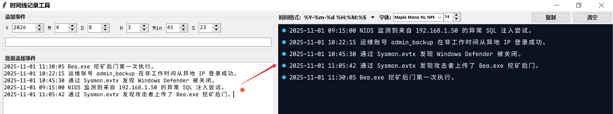

## 一、用途

输入时间与事件内容，回车，自动根据时间进行排序整理。



## 二、使用方法

### 2.1 安装依赖

- 输入下面命令安装依赖：

  ```shell
  pip install python-dateutil pyperclip
  ```

- 若已将 Python 添加到环境变量中，直接双击 `Timeline_Tool.py` 即可打开。

### 2.2 新增事件

单次新增事件：

- 选择日期 + 时间，输入事件内容回车，即可新增一条事件。

批量新增事件：

- 日期 + 时间 + 事件，一行一条事件。例如：

  ```shell
  2025-11-01 11:30:05 Bea.exe 挖矿后门第一次执行。
  2025-11-01 10:22:15 运维账号 admin_backup 在非工作时间从异地 IP 登录成功。
  2025-11-01 10:45:30 通过 Sysmon.evtx 发现 Windows Defender 被关闭。
  2025-11-01 09:15:00 NIDS 监测到来自 192.168.1.50 的异常 SQL 注入尝试。
  2025-11-01 11:05:42 通过 Sysmon.evtx 发现攻击者上传了 Bea.exe 挖矿后门。
  ```

  ```shell
  ### 排序后，相当于发生以下事件
  09:15:00 —— 攻击者 SQL 注入尝试
  10:22:15 —— 账号异常登录（源头）
  10:45:30 —— Defender 被关闭
  11:05:42 —— 被植入后门文件
  11:30:05 —— 后门文件初次执行
  ```

支持的时间格式：

|   时间格式    |        例子         |
| :-----------: | :-----------------: |
| `Y-m-d H:M:S` | 2025-11-01 11:05:42 |
| `Y/m/d H:M:S` | 2025/11/01 10:22:15 |
| `m-d-Y H:M:S` | 11-01-2025 09:15:00 |
| `Y-m-dTH:M:S` | 2025-11-01T11:05:42 |

